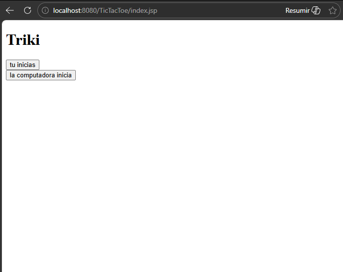

# 🎮 TicTacToe - Tres en Raya

Juego de Tres en Raya desarrollado con Java JSP y desplegado en Apache Tomcat 9.

## Descripción
Aplicación web donde el jugador compite contra la computadora.
Detecta automáticamente quién gana, pierde o si hay empate.

## Tecnologías
- Java 11
- JSP (JavaServer Pages)
- Apache Tomcat 9
- Eclipse IDE

## Cómo jugar
1. Abre el navegador en `http://IP_SERVIDOR:8080/TicTacToe`
2. Haz clic en una celda para colocar tu ficha **(X)**
3. La computadora juega automáticamente con **(O)**
4. Gana quien complete primero una fila, columna o diagonal

## Captura de pantalla
